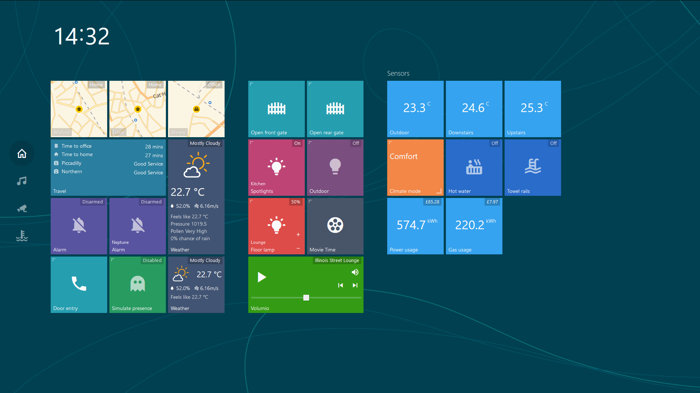
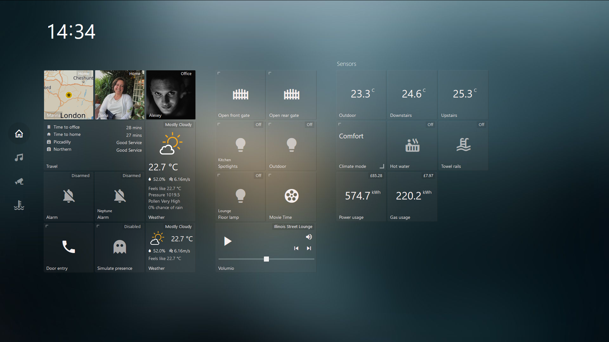
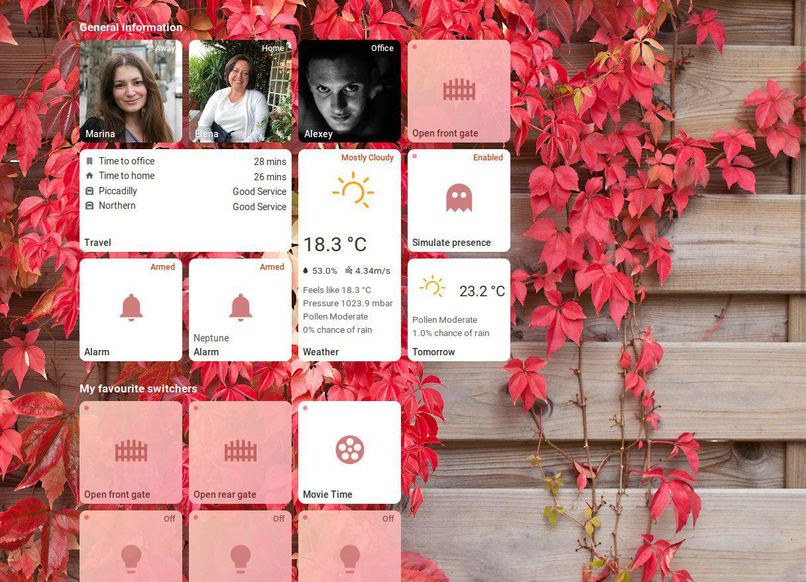

# TileBoard

This is a simple yet highly customizable dashboard for Home Assistant. The main goal of this project was to create a simple dashboard with an easy way to edit and add functionality with minimum knowledge of javascript and html.
Should you have any ideas or questions please post them on the home-assistant forum or create an issue on github.

## Links

* [Discussion on Home Assistant Community](https://community.home-assistant.io/t/new-dashboard-for-ha/57173)
* [Demo Video](https://youtu.be/L8JwzWNAPr8)


## Screenshots





## How to use
* Make sure that you have Home Assistant 0.77 or greater installed as only new authentication system is supported from now on
* Pull/download repository
* Copy `config.example.js` to `config.js` and edit it for your needs
* Create a directory called `tileboard` inside `www` directory in HA's config path and move all of the files there.
* TileBoard will be available at `http://HASS_IP:8123/local/tileboard/index.html` and will prompt you for your login credentials after restarting Home Assistant

## Configure

`config.js` will initialize a global CONFIG object with the following fields:

```js
var CONFIG = {
   /* customTheme: specify a custom theme for your dashboard
    * Valid options: null, CUSTOM_THEMES.TRANSPARENT, CUSTOM_THEMES.MATERIAL, CUSTOM_THEMES.MOBILE, CUSTOM_THEMES.COMPACT, CUSTOM_THEMES.HOMEKIT, CUSTOM_THEMES.WINPHONE, CUSTOM_THEMES.WIN95 or a custom theme you have created
    * Default: null. Array supported
    */
   customTheme: null,
   /* transition: The transition effect used between Pages
    * Valid options: TRANSITIONS.ANIMATED, TRANSITIONS.ANIMATED_GPU, TRANSITIONS.SIMPLE
    */
   transition: TRANSITIONS.ANIMATED,
   /* tileSize: The default size (in pixels) of a tile */
   tileSize: Number,
   /* tileMargin: The default margin (in pixels) between tiles */
   tileMargin: Number,
   /* entitySize: Enum size of tile's content (SMALL, NORMAL, BIG)*/
   entitySize: ENTITY_SIZES.NORMAL,
   /* groupMarginCss: CSS margin statement to override the default margin for groups */
   groupMarginCss: '20px 40px',
   /* serverUrl: The URL to your HomeAssistant server */
   serverUrl: 'http://hassio.local:8123',
   /* wsUrl: The URL to your HomeAssistant Websocket connection.
    * If HomeAssistant is behind SSL, replace ws:// with wss://
    */
   wsUrl: 'ws://hassio.local:8123/api/websocket',
   
   /* authToken: Optional Long live token that you can create in your HomeAssistant
    */
   authToken: null,
   /* pingConnection: Set to false disable pinging of the websocket connection.
    * Otherwise, a ping will be sent every five seconds, and if a response is not received in 3 seconds,
    * a reconnect will be attempted. If not included in the config file, setting defaults to true.
    */
   pingConnection: true,
   /* debug: Toggle for extra debugging information.
    * If enabled, will print info about state changes and entities to console.
    */
   debug: Boolean,
   /* timeFormat: 12 for AM/PM marker, 24 for 24 hour time (default) */
   timeFormat: Number,
   
   /* googleApiKey: Google API key is required if you are using device tracker tiles along with Google Maps.
    * More info here: https://developers.google.com/maps/documentation/maps-static/usage-and-billing
    */
   googleApiKey: null,
   /* A Mapbox token is required if you are using device tracker tiles along with Mapbox.
    * More info here: https://www.mapbox.com/maps/
    */
   mapboxToken: null,
   /* mapboxStyle: Enter a style URL to change the mapbox style for device tracker tiles.
    * The format of the url is: mapbox://styles/username/style-id
    * If no style URL is entered, the style will default to mapbox/streets-v11.
    */
   mapboxStyle: null,
   /* menuPosition: LEFT (default) or BOTTOM */
   menuPosition: MENU_POSITIONS.LEFT,
   /* hideScrollbar: Hiding horizontal scrollbar */
   hideScrollbar: false,
   
   /* groupsAlign: Align groups HORIZONTALLY (default) or VERTICALLY */
   groupsAlign: GROUP_ALIGNS.HORIZONTALLY,

   /* Called when connected to API and fetched the state.
    * Can be called multiple times in case of reconnecting.
    */
   onReady: function () {},

   /* pages: A list of page objects. See documentation on Pages below */
   pages: [],
   /* events: A list of events. See documentation on Events below */
   events: [],
   /* screensaver: A digital picture frame with a clock. Appears when    
    * the dashboard has been idle
    * https://github.com/resoai/TileBoard/wiki/Screensaver-configuration
    * (optional)
    */
   screensaver: {
     /* timeout: Idle time (in seconds) before the screensaver will show */
     timeout: 300,
     /* slidesTimeout: Amount of time (in seconds) to show each slide */
     slidesTimeout: 10,
     
     styles: { fontSize: '40px' },
     
     /* read more in wiki */
     leftBottom: [{ type: SCREENSAVER_ITEMS.DATETIME }],
     /* slides: Array of paths to pictures. */
     slides: [
       {bg: 'images/bg1.jpeg'},
       {bg: 'images/bg2.png'},
       {bg: 'images/bg3.png'}
     ]
   },
   
   /* header: object of header. Will be applied globally
    * https://github.com/resoai/TileBoard/wiki/Header-configuration
    * (optional)
    */
   header: DEFAULT_HEADER,
}
```

### Pages

Page object can have the following fields:

```js
{
  /* title: The page title (not currently used) */
  title: 'Page title',
  /* bg: Link to the background image */
  bg: 'images/bg1.jpg',
  /* icon: Page icon for the side menu */
  icon: 'mdi-home-outline', // icon of page (for the side menu)
  /* header: object of header for current page
   * https://github.com/resoai/TileBoard/wiki/Header-configuration
   */
  header: DEFAULT_HEADER,
  /* tileSize: Override the global tileSize value for the current page
     (optional)
   */
  tileSize: Number,
  /* groupMarginCss: Override global groupMarginCss for the current page
   * (optional)
   */
  groupMarginCss: '20px 40px',
  
  /* hidden: hide page (optional)
   * can be boolean or function that return boolean
   */
  hidden: Boolean | Function,
  /* groups: A list of tile groups. See documentation on Tile Groups below */
  groups: [] // list of tile groups
}
```

### Tile Groups

We divide tiles (cells) into groups on every page. Group object can have the following fields:

```js
{
  /* title: Title to display above the group */
  title: 'Group title',
  /* width: Number of tiles horizontally 
   * (optional) Can be calculated automatically 
   */
  width: 3,
  /* height: Number of tiles vertically 
   * (optional) Can be calculated automatically 
   */
  height: 4,
  /* groupMarginCss: Override default margin of tiles for the current group
   * (optional)
   */
  groupMarginCss: '20px 40px',
  
  /* hidden: hide group (optional)
   * can be boolean or function that return boolean
   */
  hidden: Boolean | Function,
  /* items: A list of Tile objects. See documentation on Tiles below */
  items: [],
}
```

### Tiles

Tile Object. [Click here for some real-life examples](TILE_EXAMPLES.md)

```js
{
  /* position: The x,y position of the tile inside the group */
  position: [1, 0],
  /* type: The type of a tile. Valid types are listed below */
  type: TYPES.DEVICE_TRACKER,
  /* id: The entity_id of the device from HomeAssistant (e.g. switch.xyz or light.family_room) */
  id: 'device_tracker.google_maps_228',
  // OPTIONAL
  /* title: Title for the entity. It will use the friendly_name from HomeAssistant if not specified
   * (optional)
   */
  title: 'Tile title',
  /* subtitle: A subtitle to display on the tile
   * (optional)
   */
  subtitle: 'Tile subtitle', // subtitle
  /* width: How many tiles wide this tile should be
   * (optional) (default=1)
   */
  width: 2,
  /* height: How many tiles tall this tile should be
   * (optional) (default=1)
   */
  height: 2,
  /* states: Map a state from HomeAssistant to a different value for TileBoard to display.
   * (optional)
   */
  states: {on: 'Enabled', off: 'Disabled'}, // Object example
  states: function (item, entity) {return entity.state}, // Function example
  /* state: Set a custom state for the tile.
   * (optional)
   */
  state: 'Working', // String example
  state: function (item, entity) {return entity.state}, // Function example
  state: false, // Set to false to disable state
  /* icons: Set the icon for a tile
   * You can use any of the material design icons from https://materialdesignicons.com/
   * as long as they have been published in the [latest npm package](https://github.com/templarian/materialdesign-svg).
   * Use an object or function to map states to icons
   */
  icons: {on: "mdi-volume-high", off: "mdi-volume-off"}, // Object example
  icons: function (item, entity) {return entity.attributes.icon}, // Function example
  /* icon: Set a static icon for a tile
   * You can use any of the material design icons from https://materialdesignicons.com/
   * as long as they have been published in the [latest npm package](https://github.com/templarian/materialdesign-svg).
   */
  icon: 'mdi-phone'
  /* bg: Link to a background image for the tile
   * @ and & prefixes are explained below
   */
  bg: '@attributes.entity_picture',
  /* bgSuffix: Same as bg, but with the serverUrl included */
  bgSuffix: '@attributes.entity_picture',
  /* bgOpacity: A decimal between 0 and 1 for the background opacity */
  bgOpacity: 0.5,
  /* theme: Override default theme for the tile */
  theme: TYPES.SWITCH,
  /* slides: A list of slide images to use for the background
   * Currently a maximum of 3 slides are supported
   * (optional)
   */
  slides: [{}, {bg: 'images/slide.jpg'}],
  
  /* action: Define a custom action on click
   * You can override the default action for any tile type.
   * This function will be evaluated, when the user clicks the tile.
   */
  action: function(item, entity) {return this.$scope.openPopupIframe(item, entity);}
  /* secondaryAction: Define a custom secondary action (on long press)
   * You can override the default secondary action for any tile type.
   * This function will be evaluated, when the user long-presses the tile.
   */
  secondaryAction: function(item, entity) {return this.$scope.openPopupIframe(item, entity);}

  /* hidden: hide tile (optional)
   * can be boolean or function that return boolean
   */
  hidden: Boolean | Function,
  /*** TILE SPECIFIC SETTINGS ***/
  /** type: SENSOR **/
  /* value: Override sensor value */
  value: '&sensor.bathroom_temp.state',
  /* unit: Override default unit of measurement */
  unit: 'kWh',
  /* filter: Function for filtering/formatting the entity value */
  filter: function (value) {return value},
  /** type: DEVICE_TRACKER **/
  /* slidesDelay: Delay before slide animation starts (optional) */
  slidesDelay: 2,
  /* map: Map provider for showing position inside tile
   * Valid options: 'google', 'mapbox', 'yandex'
   */
  map: 'google',
  
  /* zoomLevels: zoom levels of map in slides
   * left only one if you what one slide (e.g. [9])
   * (optional)
   */
  zoomLevels: [9, 13], 
  
  /* hideEntityPicture: hide entity picture if you want only maps */
  hideEntityPicture: false, 
  /** type: TEXT_LIST **/
  /* list: List of objects with a title, icon, and value */
  list: [{title: 'Kitchen temp', icon: 'mdi-home', value: '&sensor.kitchen_temp.state'}],
  /** type: MEDIA_PLAYER **/
  /* hideSource: Whether the source selector should be hidden
   * Value options: true, false
   */
  hideSource: false,
  /** type: SLIDER **/
  /* filter: Function for filtering/formatting the value */
  filter: function (value) {return value},
  /* button: Puts slider at the bottom
   * Valid options: true, false
   */
  bottom: true,
  /* slider: Object with slider config. See slider documentation below */
  slider: {}
  /** type: CAMERA or CAMERA_THUMBNAIL **/
  /* bgSize: CSS background-size property */
   bgSize: 'cover',
   /* filter: Function for filtering/formatting the camera URL */
   filter: function (url) {return url},
   /* fullscreen: object of type CAMERA or CAMERA_THUMBNAIL to show it in fullscreen */
   fullscreen: {},
   /* refresh: Number in milliseconds (or function returning a time) to set the
    * interval for refreshing the camera image
    */
   refresh: Number || Function,
   /** type: LIGHT **/
   /* sliders: list of slider object. See slider documentation below */
   sliders: [{}],
   
   /* colorpicker: whether or not the color picker should be used. 
    * Only works with lights that have the rgb_color attribute 
    * Valid options: true, false 
    */
   colorpicker: true,
   /** type: POPUP_IFRAME **/
   url: String || Function,
   /* optional */
   iframeStyles: Object || Function,
   /* optional */
   iframeClasses: Array || String || Function,
   /** type: DIMMER_SWITCH **/
   /* optional (main toggle function)*/
   action: Function,
   /* optional (function will be called with context)*/
   actionPlus: Function,
   actionMinus: Function,
   /** type: WEATHER **/
   /* fields: Object mapping available fields and their values.
    * Full documentation on fields is below
    */
   fields: {},
   /** type: GAUGE **/
   /* Object containing gauge settings. Refer to https://ashish-chopra.github.io/angular-gauge/#!#documentation */
   settings: {
      size: 200, // Defaults to 50% of either height or width, whichever is smaller
      type: 'full', // Options are: 'full', 'semi', and 'arch'. Defaults to 'full'
      min: 0, // Defaults to 0
      max: 25000, // Defaults to 100
      cap: 'round', // Options are: 'round', 'butt'. Defaults to 'butt'
      thick: 8, // Defaults to 6
      label: 'My Gauge', // Defaults to undefined
      append: '@attributes.unit_of_measurement', // Defaults to undefined
      prepend: '$', // Defaults to undefined
      duration: 1500, // Defaults to 1500ms
      thresholds: { 0: { color: 'green'}, 80: { color: 'red' } },  // Defaults to undefined
      labelOnly: false, // Defaults to false
      foregroundColor: 'rgba(0, 150, 136, 1)', // Defaults to rgba(0, 150, 136, 1)
      backgroundColor: 'rgba(0, 0, 0, 0.1)', // Defaults to rgba(0, 0, 0, 0.1)
      fractionSize: 0 // Number of decimal places to round the number to. Defaults to current locale formatting
   },

   /* classes: A list of classes to be appended to the tile element
    * Useful for custom CSS styles. 
    * Use CLASS_BIG, CLASS_SMALL or CLASS_MICRO to change the size of a tile.
    * The TYPES.WEATHER tile supports '-compact' class for a compact (1x1) tile
    * (optional)
    */
   classes: ['-compact'],
   
   /* customStyles: Additional styles. Enables tile customisation based on state.
    * Can be used both as a object `{ 'background-color': '#FF0000' }` or, 
    * as a function function (item, entity) { return { 'background-color': '#FF0000' } }
    * (optional)
    */
   customStyles: Object || Function,

   /* Object containing history settings */
   history: { // If this is present in a tile, a history popup is created on secondary action
      entity: 'sensor.temperatur_innen_gefiltert', // Entity ID (or an array of IDs) to render history for. Default: entity id of the tile itself
      offset: 24*3600*1000*5, // Start point of the history counting from now(). Default: one day
      options: { elements: {point: {radius: 3}}}, // Chart options. Refer to https://www.chartjs.org/.
      styles: { border: '1px solid red'}, // Styles to apply to the <div> containng the chart. Default according to main.css
      classes: 'clock--colon', // Classes to apply to the history popup. Default according to main.css
   },

}
```

Every anonymous function will call with context 
```js
{
   states: {}, // list of current states
   $scope: {}, // angular scope
   parseFieldValue: Function, // parser function (for parsing HA states)
   api: {}, // The Api service. Refer to Api.js for what it exposes.
   apiRequest: Function // parser function (args: data, callback=func)
}
```

At the moment following entity types have been implemented:

```js
var TYPES = {
   DEVICE_TRACKER: 'device_tracker',
   SCRIPT: 'script',
   AUTOMATION: 'automation',
   SENSOR: 'sensor',
   SENSOR_ICON: 'sensor_icon',
   SWITCH: 'switch',
   LOCK: 'lock',
   COVER: 'cover',
   COVER_TOGGLE: 'cover_toggle',
   FAN: 'fan',
   INPUT_BOOLEAN: 'input_boolean',
   LIGHT: 'light',
   TEXT_LIST: 'text_list',
   INPUT_NUMBER: 'input_number',
   INPUT_SELECT: 'input_select',
   INPUT_DATETIME: 'input_datetime',
   CAMERA: 'camera',
   CAMERA_THUMBNAIL: 'camera_thumbnail',
   SCENE: 'scene',
   SLIDER: 'slider',
   IFRAME: 'iframe',
   DOOR_ENTRY: 'door_entry',
   WEATHER: 'weather',
   CLIMATE: 'climate',
   MEDIA_PLAYER: 'media_player',
   CUSTOM: 'custom',
   ALARM: 'alarm',
   WEATHER_LIST: 'weather_list',
   VACUUM: 'vacuum',
   POPUP_IFRAME: 'popup_iframe',
   DIMMER_SWITCH: 'dimmer_switch',
   GAUGE: 'gauge',
   IMAGE: 'image',
};
```

Example of slider config used for LIGHT:

```js
{
   title: "Color temp",
   field: "color_temp",
   max: 588,
   min: 153,
   step: 15,
   request: {
      type: "call_service",
      domain: "light",
      service: "turn_on",
      field: "color_temp"
   }
}
```

Supported weather fields
```js
{
   summary: '&sensor.dark_sky_summary.state',
   temperature: '&sensor.dark_sky_temperature.state',
   temperatureUnit: '&sensor.dark_sky_temperature.attributes.unit_of_measurement',
   highTemperature: '&sensor.dark_sky_daytime_high_temperature.state',
   highTemperatureUnit: '&sensor.dark_sky_daytime_high_temperature.attributes.unit_of_measurement',
   //highTemperatureLabel: 'High',
   lowTemperature: '&sensor.dark_sky_overnight_low_temperature.state',
   lowTemperatureUnit: '&sensor.dark_sky_overnight_low_temperature.attributes.unit_of_measurement',
   //lowTemperatureLabel: 'Low',
   windSpeed: '&sensor.dark_sky_wind_speed.state',
   windSpeedUnit: '&sensor.dark_sky_wind_speed.attributes.unit_of_measurement',
   humidity: '&sensor.dark_sky_humidity.state',
   humidityUnit: '&sensor.dark_sky_humidity.attributes.unit_of_measurement',
    
   list: [ // array of strings
      // custom line
      'Feels like '
         + '&sensor.dark_sky_apparent_temperature.state'
         + '&sensor.dark_sky_apparent_temperature.attributes.unit_of_measurement',
      // another custom line
      'Pressure '
         + '&sensor.dark_sky_pressure.state'
         + '&sensor.dark_sky_pressure.attributes.unit_of_measurement',
   ]
}
```

### @/& Prefixes
As you may notice that we use @/& prefixes to get a value inside objects (entities).
@ is relative to the current entity (@attributes.friendly_name) and & is for global (&sensor.kitchen_temp.state). This may not work everywhere, but you may give it a go.
Read more in our [wiki article](https://github.com/resoai/TileBoard/wiki/Templates). 

### Events

Events can be fired from Home Assistant to control TileBoard. Useful for automation to do things like opening a camera view if it detects motion, or turning the screen off on a tablet at night or when everyone leaves.

Events in HomeAssistant must be fired with `tileboard` as the event type, and a `command` included in the event data.

```js
events: [
    /* Example: Start the screensaver on a tablet with Fully Kiosk Browser */
    {
      /* command: The command sent from Home Assistant */
      command: 'screen_off',
      /* action: Function to execute when the command is received
       * The variable e contains the full event_data from HomeAssistant
       */
      action: function(e) {
        if (typeof fully !== undefined) {
            fully.startScreensaver();
        }
      },
    },
    /* Example: End the screensaver and make sure Fully Kiosk Browser is in
     * the foreground.
     */
    {
      command: 'screen_on',
      action: function(e) {
        if (typeof fully !== undefined) {
          fully.stopScreensaver();
          fully.bringToForeground();
        }
      },
    },
    /* Example: Play a sound file
     * Include sound_url in the event_data from Home Assistant
     */
    {
      command: 'play_sound',
      action: function(e) {
        playSound(e.sound_url);
      }
    },
    /* Example: Open a specific TileBoard page
     * Include a page field in the event_data from Home Assistant
     * that matches the id: of a page in the TileBoard CONFIG
     */
    {
      command: 'open_page',
      action: function(e) {
        window.openPage(CONFIG.pages[e.page]);
      }
    }
  ],
```
Example to fire an event in a [Home Assistant automation](https://www.home-assistant.io/docs/automation/).
This example will make 'TileBoard' return to page 0 when a specific `binary_sensor` state change from `off` to `on`.
*Tip: The page number is determinate by the order of the pages in your TileBoard `CONFIG` file, the first one is `0`.*
```yaml
- alias: aquarium_ok
  initial_state: true
  trigger:
    platform: state
    entity_id: binary_sensor.seneye_param_status
    from: 'on'
    to: 'off'
  action:
    - event: tileboard
      event_data:
        page: 0
        command: 'open_page'
```
## Notifications
TileBoard has built-in support for toast notification popups in the
lower right corner. To set them up, add the following to `events` in `CONFIG`:
```js
{
   command: 'notify',
   action: function(e) {
      Noty.addObject(e);
   }
}
```
Example to fire a notification in a [Home Assistant automation](https://www.home-assistant.io/docs/automation/).
This example will fire a persistent red notification on TileBoard when a specific `binary_sensor` state change from `on` to `off`.
* Tip: To remove the persistent notification, resend the same one (or another one) with the same `id:` with the `lifetime: 1` added at the end of the `event_data`.*
```yaml
- alias: PC2_offline
  initial_state: true
  trigger:
    platform: state
    entity_id: binary_sensor.pc2
    from: 'on'
    to: 'off'
  action:
    - event: tileboard
      event_data:
        command: 'notify'
        id: 'PC2'
        icon: 'mdi-desktop-tower'
        type: 'error'
        title: 'Status - PC2'
        message: 'PC2 is offline, restart the left computer (big one)'
```
`id`: Notification ID. Sending multiple notifications with the same `id` will overwrite each other.

`type`: Type of notification (for style purposes). Valid types are `error`, `info`, `success`, `warning`

`lifetime`: Length of time (in seconds) for the notification to persist before automatically dismissing. Leave a lifetime out of the event_data for persistent messages.

## Custom CSS Styles
Several classes are added to each tile depending on the type of tile and state. Custom CSS styles can be applied by creating a `custom.css` file in the `styles` directory.

## Tablet and mobile configuration
For the tablet configuration use `COMPACT` custom theme and reduce padding. 
For the mobiles check out [wiki article](https://github.com/resoai/TileBoard/wiki/Mobile-configuration). 

## Contribution
Please feel free to post an issue or pull request and we will sort it out

## License
MIT License
