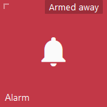
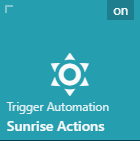
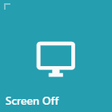
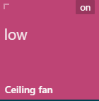
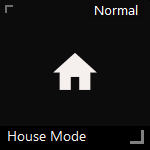
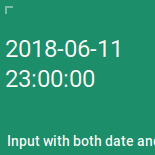
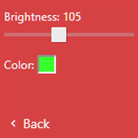
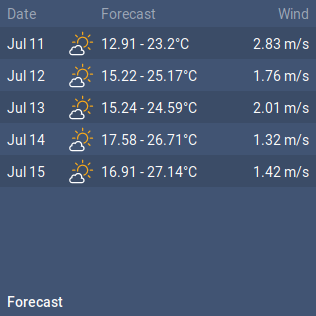
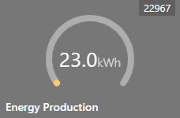

Here are some real life examples of Tiles.<br>

#### ALARM



```js
{
 position: [0, 3],
 type: TYPES.ALARM,
 title: 'Alarm',
 id: 'alarm_control_panel.home_alarm',
 icons: {
    disarmed: 'mdi-bell-off',
    pending: 'mdi-bell',
    armed_home: 'mdi-bell-plus',
    armed_away: 'mdi-bell',
    triggered: 'mdi-bell-ring'
 },
 states: {
    disarmed: 'Disarmed',
    pending: 'Pending',
    armed_home: 'Armed home',
    armed_away: 'Armed away',
    triggered: 'Triggered'
 }
}
```

#### AUTOMATION
Manually trigger an automation



```js
{
    position: [0,2],
    type: TYPES.AUTOMATION,
    title: 'Sunrise Actions',
    subtitle: 'Trigger Automation',
    id: 'automation.sunrise_actions',
    icon: 'mdi-weather-sunny'
}
```

#### CAMERA_THUMBNAIL and CAMERA
```js
{
   position: [0, 0],
   id: 'camera.front_gate',
   type: TYPES.CAMERA_THUMBNAIL,
   bgSize: 'cover',
   width: 2,
   state: false,
   fullscreen: {
      type: TYPES.CAMERA,
      refresh: 1500, // can be number in milliseconds
      bgSize: 'contain'
   },
   refresh: function () { // can also be a function
      return 3000 + Math.random() * 1000
   }
}
```

#### CAMERA_THUMBNAIL and CAMERA_STREAM
Shows a camera feed on the tile and opens a fullscreen popup with an RTSP stream when pressed.
Optionally, the fullscreen camera entity can be different from the thumbnail camera entity, for example to show a hires stream on the fullscreen popup only.

```js
{
   position: [0, 0],
   id: 'camera.front_gate',
   type: TYPES.CAMERA_THUMBNAIL,
   bgSize: 'cover',
   width: 2,
   state: false,
   fullscreen: {
      type: TYPES.CAMERA_STREAM,
      objFit: 'contain',
      id: 'camera.front_gate_highres',  // Optional: camera entity to use on fullscreen, defaults to the tile camera entity if omitted
      bufferLength: 5  // Optional: buffer length in seconds for the HLS buffer, default is 5 seconds
   },
   refresh: function () { // can also be a function
      return 3000 + Math.random() * 1000
   }
}
```


#### CLIMATE

```js
{
   position: [0, 2],
   id: "climate.kitchen",
   type: TYPES.CLIMATE,
   unit: 'C',
   state: function (item, entity) {
      return 'Current '
         + entity.attributes.current_temperature
         + entity.attributes.unit_of_measurement;
   }
}
```

#### CUSTOM
The custom tile type does not have handling for any specific entity types. It can be used to, for example, trigger custom actions on pressing.



```js
{
   position: [0, 0],
   type: TYPES.CUSTOM,
   title: 'Screen Off',
   id: { },
   icon: 'mdi-monitor',
   customHtml: '<b>Hi</b>',  // Can also be a function that will be passed item and entity.
   action: function(item, entity) {
        fully.startScreensaver();
   },
   secondaryAction: function(item, entity) {
      return this.$scope.openPopupIframe(item, entity);
   }
},
```

#### DEVICE_TRACKER


```js
{
   position: [0, 0],
   type: TYPES.DEVICE_TRACKER,
   id: 'device_tracker.google_maps_9000',
   map: 'yandex',
   states: {
      home: "Home",
      not_home: "Away",
      office: "Office",
   },
   zoomLevels: [9, 13], // or [9] for only one map slide
   hideEntityPicture: false, //hide entity pic, if you need only map
   slidesDelay: 2 // delay before first slide animation
}
```

#### DOOR_ENTRY
Essentially a door entry tile is a pop-up with a fullscreen camera and a set of tiles on the left.
```js
{
    position: [0, 3],
    type: TYPES.DOOR_ENTRY,
    id: {},
    icon: 'mdi-phone',
    title: 'Door entry',
    state: false,
    layout: {
        camera: {
            type: TYPES.CAMERA,
            id: 'camera.front_gate',
            refresh: 1500,
            bgSize: 'cover'
        },
        page: {},
        tiles: [{
                position: [0, 0],
                theme: ITEM_TRANSPARENT,
                type: TYPES.SWITCH,
                id: 'switch.intercom',
                icons: {
                    on: 'mdi-phone-in-talk',
                    off: 'mdi-phone'
                },
                states: {
                    on: "Active",
                    off: "Idle"
                }
            },
            {
                position: [0, 1],
                theme: ITEM_TRANSPARENT,
                type: TYPES.SCRIPT,
                id: 'script.front_gate_open',
                icons: {
                    on: "mdi-gate",
                    off: "mdi-gate"
                },
                state: false
            },
            {
                position: [0, 2],
                theme: ITEM_TRANSPARENT,
                id: 'switch.outdoor_lights',
                type: TYPES.SWITCH,
                title: 'Lights',
                states: {
                    on: "On",
                    off: "Off"
                },
                icons: {
                    on: "mdi-lightbulb-on",
                    off: "mdi-lightbulb",
                }
            }
        ]
    }
}
```

#### FAN
Allows you to toggle a fan on and off, as well as set the speed.


```js
{
   position: [0, 2],
   type: TYPES.FAN,
   title: 'Ceiling fan',
   id: 'fan.living_room_fan',
}
```

#### IFRAME
```js
{
   position: [0, 3],
   type: TYPES.IFRAME,
   id: {},
   width: 3,
   height: 2,
   refresh: 10000, // 10 seconds
   url: 'https://www.youtube.com/embed/_qNhxxo9rVU?autoplay=1'
}
```

#### POPUP_IFRAME
Allows opening popup with iframe content opened from specified URL.
Also alows showing custom HTML content in the tile.

```js
{
   position: [0, 3],
   type: TYPES.POPUP_IFRAME,
   id: {},
   width: 3,
   height: 2,
   customHtml: '<b>Hi</b>',  // Can also be a function that will be passed item and entity.
   url: 'https://www.youtube.com/embed/_qNhxxo9rVU?autoplay=1'
}
```

#### INPUT_BOOLEAN
```js
{
   position: [1, 2],
   width: 1,
   title: 'Radio',
   classes: [CLASS_BIG],
   type: TYPES.INPUT_BOOLEAN,
   id: 'input_boolean.play_radio',
   icons: {
      on: 'mdi-stop',
      off: 'mdi-play'
   },
   states: {
      on: "Playing",
      off: "Stopped"
   }
}
```

#### INPUT_SELECT

```js
{
   position: [0, 1],
   type: TYPES.INPUT_SELECT,
   id: 'input_select.climate_mode',
   state: false
}
```


```js
{
   position: [0, 1],
   type: TYPES.INPUT_SELECT,
   id: 'input_select.house_mode',
   title: 'House Mode',
   icons: {
      Normal: 'mdi-home',
      Vacation: 'mdi-palm-tree',
      Sick: 'mdi-medical-bag',
      Travel: 'mdi-airplane'
   }
}
```


#### INPUT_DATETIME

```js
{
   position: [0, 3],
   type: TYPES.INPUT_DATETIME,
   state: false,
   id: "input_datetime.both_date_and_time",
}
```

#### LIGHT
Light switch. You can optionally define sliders to control colour temperature or in fact anything else. Sliders will show up after long press on the tile. Color Picker is also optionally displayed after long press on the tile. Color picker should only be used for lights with rgb_color attribute.<br>



```js
{
   position: [0, 2],
   title: 'Floor lamp',
   subtitle: 'Lounge',
   id: 'light.lounge_floor_lamp',
   type: TYPES.LIGHT,
   states: {
      on: "On",
      off: "Off"
   },
   icons: {
      on: "mdi-lightbulb-on",
      off: "mdi-lightbulb",
   },
   sliders: [
      {
         title: 'Brightness',
         field: 'brightness',
         max: 255,
         min: 0,
         step: 5,
         request: {
            type: "call_service",
            domain: "light",
            service: "turn_on",
            field: "brightness"
         }
      },
      {
         title: 'Color temp',
         field: 'color_temp',
         max: 588,
         min: 153,
         step: 15,
         request: {
            type: "call_service",
            domain: "light",
            service: "turn_on",
            field: "color_temp"
         }
      }
   ],
   colorpicker: true
}
```

#### LOCK
Locks and unlocks the lock on tap. Also shows icon depending on the state<br>

```js
{
   position: [0, 1],
   type: TYPES.LOCK,
   id: 'lock.front_door',
   title: 'Front door',
   states: {
      locked: "Locked",
      unlocked: "Unlocked"
   },
   icons: {
      locked: "mdi-lock",
      unlocked: "mdi-lock-open",
   }
}
```

#### MEDIA_PLAYER

```js
{
   position: [0, 3],
   id: 'media_player.volumio',
   type: TYPES.MEDIA_PLAYER,
   hideSource: false,
   hideMuteButton: false,
   state: false,
   //state: '@attributes.media_title',
   subtitle: '@attributes.media_title',
   bgSuffix: '@attributes.entity_picture',
},
```

#### SCENE
Works almost identical to the SCRIPT. Activates scene in a tap.
```js
{
   position: [1, 2],
   id: 'scene.movie_time',
   type: TYPES.SCENE,
   state: false,
   icon: 'mdi-movie-roll',
},
```

#### SCRIPT
Call script on click/tap<br>


```js
{
   position: [0, 0],
   type: TYPES.SCRIPT,
   id: 'script.front_gate_open',
   icons: {
      on: "mdi-gate",
      off: "mdi-gate"
   },
   state: false
}
```

#### SENSOR

```js
{
   position: [0, 0],
   type: TYPES.SENSOR,
   title: 'Outdoor',
   id: 'sensor.outdoor_temperature',
   unit: 'C', // override default entity unit
   state: false, // hidding state
   filter: function (value) { // optional
      var num = parseFloat(value);
      return num && !isNaN(num) ? num.toFixed(1) : value;
   }
}
```

#### SENSOR_ICON
Similar to sensor, but with an icon.<br>

```js
{
   position: [1, 1],
   type: TYPES.SENSOR_ICON,
   title: 'Hot water',
   id: 'sensor.hot_water',
   states: {
      on: "On",
      off: "Off"
   },
   icons: {
      on: 'mdi-hot-tub',
      off: 'mdi-hot-tub'
   },
}
```

#### SLIDER

```js
{
   position: [6, 1],
   id: 'input_number.casatunes_volume_6',
   type: TYPES.SLIDER,
   unit: '%',
   state: false,
   //bottom: true, // puts slider on bottom
   slider: {
      //max: 100,
      //min: 0,
      //step: 2,
      request: {
         type: "call_service",
         domain: "input_number",
         service: "set_value",
         field: "value"
      }
   }
}
```

#### SWITCH
Toggle switch on tap. Also shows icon depending on the state<br>

```js
{
   position: [0, 1],
   type: TYPES.SWITCH,
   id: 'switch.kitchen_spotlights',
   title: 'Spotlights',
   subtitle: 'Kitchen',
   states: {
      on: "On",
      off: "Off"
   },
   icons: {
      on: "mdi-lightbulb-on",
      off: "mdi-lightbulb",
   }
}
```

#### TEXT_LIST
This is a custom tile which can be used for displaying values from different sensors in a list.<br>

```js
{
   position: [0, 1],
   width: 2,
   height: 1,
   title: 'Travel',
   id: {}, // since we are binding each list item to different sensor, so we simply use an empty object
   type: TYPES.TEXT_LIST,
   state: false,
   list: [
      {
         title: 'Time to office',
         icon: 'mdi-office-building',
         value: '&sensor.home_to_office.attributes.duration'
      },
      {
         title: 'Time to home',
         icon: 'mdi-home',
         value: '&sensor.office_to_home.attributes.duration'
      },
      {
         title: 'Northern',
         icon: 'mdi-subway',
         value: '&sensor.northern.state'
      }
   ]
}
```

#### WEATHER

<br>
```js
{
   position: [2, 1],
   height: 2,
   //classes: ['-compact'], // enable this if you want a little square tile (1x1)
   type: TYPES.WEATHER,
   id: 'group.weather',
   state: '&sensor.dark_sky_summary.state', // label with weather summary (e.g. Sunny)
   icon: '&sensor.dark_sky_icon.state',
   //iconImage: '&sensor.dark_sky_icon.state', // use this one if you want to replace icon with image
   icons: {
      'clear-day': 'clear',
      'clear-night': 'nt-clear',
      'cloudy': 'cloudy',
      'rain': 'rain',
      'sleet': 'sleet',
      'snow': 'snow',
      'wind': 'hazy',
      'fog': 'fog',
      'partly-cloudy-day': 'partlycloudy',
      'partly-cloudy-night': 'nt-partlycloudy'
   },
   fields: { // most of that fields are optional
      summary: '&sensor.dark_sky_summary.state',
      temperature: '&sensor.dark_sky_temperature.state',
      temperatureUnit: '&sensor.dark_sky_temperature.attributes.unit_of_measurement',
      windSpeed: '&sensor.dark_sky_wind_speed.state',
      windSpeedUnit: '&sensor.dark_sky_wind_speed.attributes.unit_of_measurement',
      humidity: '&sensor.dark_sky_humidity.state',
      humidityUnit: '&sensor.dark_sky_humidity.attributes.unit_of_measurement',

      list: [
         // custom line
         'Feels like '
            + '&sensor.dark_sky_apparent_temperature.state'
            + '&sensor.dark_sky_apparent_temperature.attributes.unit_of_measurement',

         // another custom line
         'Pressure '
            + '&sensor.dark_sky_pressure.state'
            + '&sensor.dark_sky_pressure.attributes.unit_of_measurement',

         // yet another custom line
         '&sensor.dark_sky_precip_probability.state'
            + '&sensor.dark_sky_precip_probability.attributes.unit_of_measurement'
            + ' chance of rain'
      ]
   }
}
```

#### WEATHER_LIST
<br>
```js
{
   position: [0, 1],
   type: TYPES.WEATHER_LIST,
   width: 2,
   height: 2,
   title: 'Forecast',
   id: {},
   icons: {
      'clear-day': 'clear',
      'clear-night': 'nt-clear',
      'cloudy': 'cloudy',
      'rain': 'rain',
      'sleet': 'sleet',
      'snow': 'snow',
      'wind': 'hazy',
      'fog': 'fog',
      'partly-cloudy-day': 'partlycloudy',
      'partly-cloudy-night': 'nt-partlycloudy'
   },
   hideHeader: false,
   secondaryTitle: 'Wind',
   list: [1,2,3,4,5].map(function (id) {
      var forecast = "&sensor.dark_sky_overnight_low_temperature_" + id + "d.state - ";
      forecast += "&sensor.dark_sky_daytime_high_temperature_" + id + "d.state";
      forecast += "&sensor.dark_sky_daytime_high_temperature_" + id + "d.attributes.unit_of_measurement";

      var wind = "&sensor.dark_sky_wind_speed_" + id + "d.state";
      wind += " &sensor.dark_sky_wind_speed_" + id + "d.attributes.unit_of_measurement";

      return {
         date: function () {
            var d = new Date(Date.now() + id * 24 * 60 * 60 * 1000);
            return d.toString().split(' ').slice(1, 3).join(' ');
         },
         icon: "&sensor.dark_sky_icon_" + id + ".state",
         //iconImage: null, replace icon with image
         primary: forecast,
         secondary: wind
      }
   })
}
```

#### GAUGE
<br>
```js
{
   position: [0, 1.5],
   width: 1.5,
   height: 1,
   title: 'Energy Production',
   subtitle: '',
   type: TYPES.GAUGE,
   id: 'sensor.my_enery_sensor', // Assign the sensor you want to display on the gauge
   value: function(item, entity){
      return entity.state;
   },
   settings: {
      size: 200, // Defaults to 50% of either height or width, whichever is smaller
      type: 'full', // Options are: 'full', 'semi', and 'arch'. Defaults to 'full'
      min: 0, // Defaults to 0
      max: 100, // Defaults to 100
      cap: 'round', // Options are: 'round', 'butt'. Defaults to 'butt'
      thick: 6, // Defaults to 6
      label: 'My Gauge', // Defaults to undefined
      append: '@attributes.unit_of_measurement', // Defaults to undefined
      prepend: '$', // Defaults to undefined
      duration: 1500, // Defaults to 1500ms
      thresholds: { 0: { color: 'green'}, 80: { color: 'red' } },  // Defaults to undefined
      labelOnly: false, // Defaults to false
      foregroundColor: 'rgba(0, 150, 136, 1)', // Defaults to rgba(0, 150, 136, 1)
      backgroundColor: 'rgba(0, 0, 0, 0.1)', // Defaults to rgba(0, 0, 0, 0.1)
      fractionSize: 0, // Number of decimal places to round the number to. Defaults to current locale formatting
   },
}
```


#### IMAGE
<br>
```js
{
   position: [0, 1],
   type: TYPES.IMAGE,
   id: {},
   url: '../qrcode.png'
}
```
