Here are some real life examples of Tiles.<br>

#### DEVICE_TRACKER
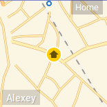

```js
{
   position: [0, 0],
   type: TYPES.DEVICE_TRACKER,
   id: 'device_tracker.google_maps_9000',
   map: 'yandex',
   states: {
      home: "Home",
      not_home: "Away",
      office: "Office",
   },
   slidesDelay: 2
}
```

#### TEXT_LIST
This is a custom tile which can be used for displaying valued from different sensors in a list.<br>
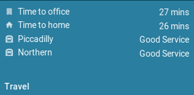
```js
{
   position: [0, 1],
   width: 2,
   height: 1,
   title: 'Travel',
   id: {}, // since we are binding each list item to different sensor, so we simply use an empty object
   type: TYPES.TEXT_LIST,
   state: false,
   list: [
      {
         title: 'Time to office',
         icon: 'mdi-office-building',
         value: '&sensor.home_to_office.attributes.duration'
      },
      {
         title: 'Time to home',
         icon: 'mdi-home',
         value: '&sensor.office_to_home.attributes.duration'
      },
      {
         title: 'Northern',
         icon: 'mdi-subway',
         value: '&sensor.northern.state'
      }
   ]
}
```

#### WEATHER
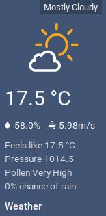
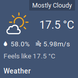<br>
```js
{
   position: [2, 1],
   height: 2,
   //classes: ['-compact'], // enable this if you want a little square tile (1x1)
   type: TYPES.WEATHER,
   id: 'group.weather',
   state: '&sensor.dark_sky_summary.state', // label with weather summary (e.g. Sunny)
   fields: { // most of that fields are optional
      icon: '&sensor.dark_sky_icon.state',
      iconMap: {
         'clear-day': 'clear',
         'clear-night': 'nt-clear',
         'cloudy': 'cloudy',
         'rain': 'rain',
         'sleet': 'sleet',
         'snow': 'snow',
         'wind': 'hazy',
         'fog': 'fog',
         'partly-cloudy-day': 'partlycloudy',
         'partly-cloudy-night': 'nt-partlycloudy'
      },
      summary: '&sensor.dark_sky_summary.state',
      apparentTemperature: '&sensor.dark_sky_apparent_temperature.state',
      apparentTemperatureUnit: '&sensor.dark_sky_apparent_temperature.attributes.unit_of_measurement',
      temperature: '&sensor.dark_sky_temperature.state',
      temperatureUnit: '&sensor.dark_sky_temperature.attributes.unit_of_measurement',
      highTemperature: '&sensor.dark_sky_daytime_high_temperature.state',
      highTemperatureUnit: '&sensor.dark_sky_daytime_high_temperature.attributes.unit_of_measurement',
      lowTemperature: '&sensor.dark_sky_overnight_low_temperature.state',
      lowTemperatureUnit: '&sensor.dark_sky_overnight_low_temperature.attributes.unit_of_measurement',
      precip: '&sensor.dark_sky_precip.state',
      precipIntensity: '&sensor.dark_sky_precip_intensity.state',
      precipIntensityUnit: '&sensor.dark_sky_precip_intensity.attributes.unit_of_measurement',
      precipProbability: '&sensor.dark_sky_precip_probability.state',
      precipProbabilityUnit: '&sensor.dark_sky_precip_probability.attributes.unit_of_measurement',
      windSpeed: '&sensor.dark_sky_wind_speed.state',
      windSpeedUnit: '&sensor.dark_sky_wind_speed.attributes.unit_of_measurement',
      humidity: '&sensor.dark_sky_humidity.state',
      humidityUnit: '&sensor.dark_sky_humidity.attributes.unit_of_measurement',
      pollen: '&sensor.pollen_count.state', // this is a value from a custom REST sensor
      pressure: '&sensor.dark_sky_pressure.state',
      pressureUnit: '', //'&sensor.dark_sky_pressure.attributes.unit_of_measurement',
   }
}
```

#### SCRIPT
Call script on click/tap<br>


```js
{
   position: [0, 0],
   type: TYPES.SCRIPT,
   id: 'script.front_gate_open',
   icons: {
      on: "mdi-gate",
      off: "mdi-gate"
   },
   state: false
}
```

#### SWITCH
Toggle switch on tap. Also shows icon depending on the state<br>
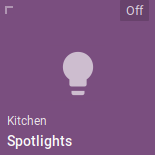
```js
{
   position: [0, 1],
   type: TYPES.SWITCH,
   id: 'switch.kitchen_spotlights',
   title: 'Spotlights',
   subtitle: 'Kitchen',
   states: {
      on: "On",
      off: "Off"
   },
   icons: {
      on: "mdi-lightbulb-on",
      off: "mdi-lightbulb",
   }
}
```

#### LOCK
Locks and unlocks the lock on tap. Also shows icon depending on the state<br>
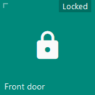
```js
{
   position: [0, 1],
   type: TYPES.LOCK,
   id: 'lock.front_door',
   title: 'Front door',
   states: {
      locked: "Locked",
      unlocked: "Unlocked"
   },
   icons: {
      locked: "mdi-lock",
      unlocked: "mdi-lock-open",
   }
}
```

#### LIGHT
Light switch. You can optionally define sliders to control colour temperature or in fact anything else. Sliders will show up after long press on the tile.<br>
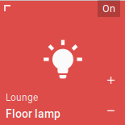
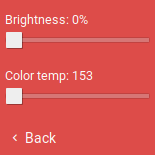
```js
{
   position: [0, 2],
   title: 'Floor lamp',
   subtitle: 'Lounge',
   id: 'light.lounge_floor_lamp',
   type: TYPES.LIGHT,
   states: {
      on: "On",
      off: "Off"
   },
   icons: {
      on: "mdi-lightbulb-on",
      off: "mdi-lightbulb",
   },
   sliders: [
      {
         title: 'Brightness',
         field: 'brightness',
         max: 255,
         min: 0,
         step: 5,
         request: {
            type: "call_service",
            domain: "light",
            service: "turn_on",
            field: "brightness"
         }
      },
      {
         title: 'Color temp',
         field: 'color_temp',
         max: 588,
         min: 153,
         step: 15,
         request: {
            type: "call_service",
            domain: "light",
            service: "turn_on",
            field: "color_temp"
         }
      }
   ]
}
```

#### SCENE
Works almost identical to the SCRIPT. Activates scene in a tap.
```js
{
   position: [1, 2],
   id: 'scene.movie_time',
   type: TYPES.SCENE,
   state: false,
   icon: 'mdi-movie-roll',
},
```

#### MEDIA_PLAYER
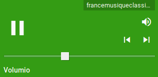
```js
{
   position: [0, 3],
   width: 2,
   id: 'media_player.volumio',
   type: TYPES.MEDIA_PLAYER,
   state: '@attributes.media_title',
   bgSuffix: '@attributes.entity_picture', // show picture of current media as a background
},
```

#### SENSOR
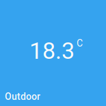
```js
{
   position: [0, 0],
   type: TYPES.SENSOR,
   title: 'Outdoor',
   id: 'sensor.outdoor_temperature',
   unit: 'C', // override default entity unit
   state: false, // hidding state
   filter: function (value) { // optional
      var num = parseFloat(value);
      return num && !isNaN(num) ? num.toFixed(1) : value;
   }
}
```

#### INPUT_SELECT

```js
{
   position: [0, 1],
   type: TYPES.INPUT_SELECT,
   id: 'input_select.climate_mode',
   state: false
}
```

#### SENSOR_ICON
Similar to sensor, but with an icon.<br>
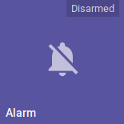
```js
{
   position: [1, 1],
   type: TYPES.SENSOR_ICON,
   title: 'Hot water',
   id: 'sensor.hot_water',
   states: {
      on: "On",
      off: "Off"
   },
   icons: {
      on: 'mdi-hot-tub',
      off: 'mdi-hot-tub'
   },
}
```

#### SLIDER
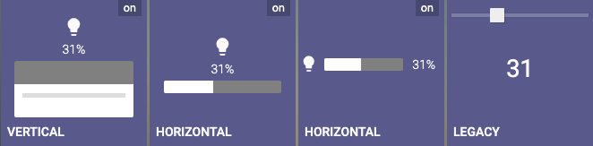
```js
{
   position: [6, 1],
   id: 'input_number.casatunes_volume_6',
   type: TYPES.SLIDER,
   unit: '%',
   state: false,
   //bottom: true, // puts slider on bottom
   slider: {
      //max: 100,
      //min: 0,
      //step: 2,
      request: {
         type: "call_service",
         domain: "input_number",
         service: "set_value",
         field: "value"
      }
   }
}
```

#### INPUT_BOOLEAN
```js
{
   position: [1, 2],
   width: 1,
   title: 'Radio',
   classes: [CLASS_BIG],
   type: TYPES.INPUT_BOOLEAN,
   id: 'input_boolean.play_radio',
   icons: {
      on: 'mdi-stop',
      off: 'mdi-play'
   },
   states: {
      on: "Playing",
      off: "Stopped"
   }
}
```

#### CAMERA_THUMBNAIL and CAMERA
```js
{
   position: [0, 0],
   id: 'camera.front_gate',
   type: TYPES.CAMERA_THUMBNAIL,
   bgSize: 'cover',
   width: 2,
   state: false,
   fullscreen: {
      type: TYPES.CAMERA,
      refresh: 1500, // can be number in milliseconds
      bgSize: 'contain'
   },
   refresh: function () { // can also be a function
      return 3000 + Math.random() * 1000
   }
}
```

#### CLIMATE
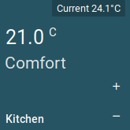
```js
{
   position: [0, 2],
   id: "climate.kitchen",
   type: TYPES.CLIMATE,
   unit: 'C',
   state: function (item, entity) {
      return 'Current '
         + entity.attributes.current_temperature
         + entity.attributes.unit_of_measurement;
   }
}
```
#### IFRAME
```js
{
      position: [0, 3],
      type: TYPES.IFRAME,
      id: {},
      width: 3,
      height: 2,
      refresh: 10000, // 10 seconds
      url: 'https://www.youtube.com/embed/_qNhxxo9rVU?autoplay=1'
}
```
#### DOOR_ENTRY
Essentially a door entry tile is a pop-up with a fullscreen camera and a set of tiles on the left.
```js
{
    position: [0, 3],
    type: TYPES.DOOR_ENTRY,
    id: {},
    icon: 'mdi-phone',
    title: 'Door entry',
    state: false,
    layout: {
        camera: {
            type: TYPES.CAMERA,
            id: 'camera.front_gate',
            refresh: 1500,
            bgSize: 'cover',
            filter: function (item, entity) {
                  return CONFIG.serverUrl
                    + entity.attributes.entity_picture
                    + (CONFIG.password ? '&api_password=' + encodeURIComponent(CONFIG.password) : '');
            },
        },
        page: {},
        tiles: [{
                position: [0, 0],
                theme: ITEM_TRANSPARENT,
                type: TYPES.SWITCH,
                id: 'switch.intercom',
                icons: {
                    on: 'mdi-phone-in-talk',
                    off: 'mdi-phone'
                },
                states: {
                    on: "Active",
                    off: "Idle"
                }
            },
            {
                position: [0, 1],
                theme: ITEM_TRANSPARENT,
                type: TYPES.SCRIPT,
                id: 'script.front_gate_open',
                icons: {
                    on: "mdi-gate",
                    off: "mdi-gate"
                },
                state: false
            },
            {
                position: [0, 2],
                theme: ITEM_TRANSPARENT,
                id: 'switch.outdoor_lights',
                type: TYPES.SWITCH,
                title: 'Lights',
                states: {
                    on: "On",
                    off: "Off"
                },
                icons: {
                    on: "mdi-lightbulb-on",
                    off: "mdi-lightbulb",
                }
            }
        ]
    }
}
```
