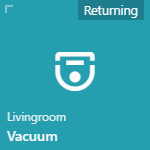

Here are some real life examples of Tiles.<br>

#### ALARM


```js
{
   position: [0, 3],
   type: TYPES.ALARM,
   title: 'Alarm',
   id: 'alarm_control_panel.home_alarm',
   icons: {
      arming: 'mdi-bell-outline',
      disarmed: 'mdi-bell-off',
      pending: 'mdi-bell',
      armed_custom_bypass: 'mdi-bell-check',
      armed_home: 'mdi-bell-plus',
      armed_night: 'mdi-bell-sleep',
      armed_away: 'mdi-bell',
      triggered: 'mdi-bell-ring'
   },
   states: {
      arming: 'Arming',
      disarmed: 'Disarmed',
      pending: 'Pending',
      armed_custom_bypass: 'Armed (bypass)',
      armed_home: 'Armed (home)',
      armed_night: 'Armed (night)',
      armed_away: 'Armed (away)',
      triggered: 'Triggered'
   }
}
```

#### AUTOMATION
Manually trigger an automation


```js
{
    position: [0,2],
    type: TYPES.AUTOMATION,
    title: 'Sunrise Actions',
    subtitle: 'Trigger Automation',
    id: 'automation.sunrise_actions',
    icon: 'mdi-weather-sunny'
}
```

#### CAMERA and CAMERA_STREAM

Shows a camera snapshot on the tile (can also refresh every specified amount of time) and opens a fullscreen popup with an RTSP stream when pressed.
Optionally, the fullscreen camera entity can be different from the camera entity, for example to show a hi-res stream on the fullscreen popup only.

**Note**: Make sure to enable the `stream` integration (https://www.home-assistant.io/integrations/stream/) in Home-assistant for the CAMERA_STREAM tile to work.

```js
{
   position: [0, 0],
   id: 'camera.front_gate',
   type: TYPES.CAMERA,
   bgSize: 'cover',
   width: 2,
   state: false,
   fullscreen: {
      type: TYPES.CAMERA_STREAM,
      objFit: 'contain',  // https://developer.mozilla.org/en-US/docs/Web/CSS/object-fit
      id: 'camera.front_gate_highres',  // Optional: camera entity to use on fullscreen, defaults to the tile camera entity if omitted
      bufferLength: 5  // Optional: buffer length in seconds for the HLS buffer, default is 5 seconds
   },
   refresh: 1500,  // can be number in milliseconds
   refresh: function () {  // can also be a function
      return 3000 + Math.random() * 1000
   }
}
```


#### CLIMATE

```js
{
   position: [0, 2],
   id: "climate.kitchen",
   type: TYPES.CLIMATE,
   unit: 'C',
   useHvacMode: false,  // Optional: enables HVAC mode (by default uses PRESET mode)
   state: function (item, entity) {
      return 'Current '
         + entity.attributes.current_temperature
         + entity.attributes.unit_of_measurement;
   },
   states: {
      'auto': 'Automatic',
      'heat': 'Manual',
      'off': 'Off',
   },
}
```

#### CUSTOM
The custom tile type does not have handling for any specific entity types. It can be used to, for example, trigger custom actions on pressing.


```js
{
   position: [0, 0],
   type: TYPES.CUSTOM,
   title: 'Screen Off',
   id: { },
   icon: 'mdi-monitor',
   customHtml: '<b>Hi</b>',  // Can also be a function that will be passed item and entity.
   action: function(item, entity) {
        window.fully.startScreensaver();
   },
   secondaryAction: function(item, entity) {
      return this.$scope.openPopupIframe(item, entity);
   }
},
```

#### DEVICE_TRACKER


```js
{
   position: [0, 0],
   type: TYPES.DEVICE_TRACKER,
   id: 'device_tracker.google_maps_9000',
   map: 'yandex',
   states: {
      home: "Home",
      not_home: "Away",
      office: "Office",
   },
   zoomLevels: [9, 13], // or [9] for only one map slide
   hideEntityPicture: false, //hide entity pic, if you need only map
   slidesDelay: 2 // delay before first slide animation
}
```

#### DOOR_ENTRY
Essentially a door entry tile is a pop-up with a fullscreen camera and a set of tiles on the left.
```js
{
    position: [0, 3],
    type: TYPES.DOOR_ENTRY,
    id: {},
    icon: 'mdi-phone',
    title: 'Door entry',
    state: false,
    layout: {
        camera: {
            type: TYPES.CAMERA,
            objFit: 'contain',  // https://developer.mozilla.org/en-US/docs/Web/CSS/object-fit
            id: 'camera.front_gate',
            refresh: 1500,
            bgSize: 'cover'
        },
        page: {},
        tiles: [{
                position: [0, 0],
                theme: ITEM_TRANSPARENT,
                type: TYPES.SWITCH,
                id: 'switch.intercom',
                icons: {
                    on: 'mdi-phone-in-talk',
                    off: 'mdi-phone'
                },
                states: {
                    on: "Active",
                    off: "Idle"
                }
            },
            {
                position: [0, 1],
                theme: ITEM_TRANSPARENT,
                type: TYPES.SCRIPT,
                id: 'script.front_gate_open',
                icons: {
                    on: "mdi-gate",
                    off: "mdi-gate"
                },
                state: false
            },
            {
                position: [0, 2],
                theme: ITEM_TRANSPARENT,
                id: 'switch.outdoor_lights',
                type: TYPES.SWITCH,
                title: 'Lights',
                states: {
                    on: "On",
                    off: "Off"
                },
                icons: {
                    on: "mdi-lightbulb-on",
                    off: "mdi-lightbulb",
                }
            }
        ]
    }
}
```

#### FAN
Allows you to toggle a fan on and off, as well as set the speed.


```js
{
   position: [0, 2],
   type: TYPES.FAN,
   title: 'Ceiling fan',
   id: 'fan.living_room_fan',
}
```

#### HISTORY
Displays the history of defined states.
The variable `MINIMAL_CHART_OPTIONS` defines options for a minimal chart suited to be displayed in a tile.


```js
{
   position: [0, 1],
   type: TYPES.HISTORY,
   id: 'sensor.covid',
   title: 'COVID-19 in Köln',
   subtitle: function (item, entity) {
      return 'since ' + timeAgo(Date.now() - (item.offset || 24*3600*1000));
   },
   offset: 5*24*3600*1000,
   options: MINIMAL_CHART_OPTIONS,
},
```

#### IFRAME
```js
{
   position: [0, 3],
   type: TYPES.IFRAME,
   id: {},
   width: 3,
   height: 2,
   refresh: 10000, // 10 seconds
   url: 'https://www.youtube.com/embed/_qNhxxo9rVU?autoplay=1'
}
```

#### POPUP_IFRAME
Allows opening popup with iframe content opened from specified URL.
Also alows showing custom HTML content in the tile.

```js
{
   position: [0, 3],
   type: TYPES.POPUP_IFRAME,
   id: {},
   width: 3,
   height: 2,
   customHtml: '<b>Hi</b>',  // Can also be a function that will be passed item and entity.
   url: 'https://www.youtube.com/embed/_qNhxxo9rVU?autoplay=1'
}
```

#### POPUP
Opens a popup when clicked. 
The popup contents can be configured with any tile you like.
Think of the popup as a single stand-alone `group` of tiles.

<br>


```js
{
   type: TYPES.POPUP,
   id: {},
   icon: 'mdi-android',
   title: 'History popup',
   state: false,
   popup: {
      tileSize: 100,
      items: [
         {
            position: [1, 1],
            type: TYPES.SENSOR,
            id: 'sensor.covid',
         },
      ]
   }
},
```

#### INPUT_BOOLEAN
```js
{
   position: [1, 2],
   width: 1,
   title: 'Radio',
   classes: [CLASS_BIG],
   type: TYPES.INPUT_BOOLEAN,
   id: 'input_boolean.play_radio',
   icons: {
      on: 'mdi-stop',
      off: 'mdi-play'
   },
   states: {
      on: "Playing",
      off: "Stopped"
   }
}
```

#### INPUT_SELECT

```js
{
   position: [0, 1],
   type: TYPES.INPUT_SELECT,
   id: 'input_select.climate_mode',
   state: false
}
```


```js
{
   position: [0, 1],
   type: TYPES.INPUT_SELECT,
   id: 'input_select.house_mode',
   title: 'House Mode',
   icons: {
      Normal: 'mdi-home',
      Vacation: 'mdi-palm-tree',
      Sick: 'mdi-medical-bag',
      Travel: 'mdi-airplane'
   }
}
```


#### INPUT_DATETIME

```js
{
   position: [0, 3],
   type: TYPES.INPUT_DATETIME,
   state: false,
   id: "input_datetime.both_date_and_time",
}
```

#### LIGHT
Light switch. You can optionally define sliders to control colour temperature or in fact anything else. Sliders will show up after long press on the tile. Color Picker is also optionally displayed after long press on the tile. Color picker should only be used for lights with rgb_color attribute.<br>


```js
{
   position: [0, 2],
   title: 'Floor lamp',
   subtitle: 'Lounge',
   id: 'light.lounge_floor_lamp',
   type: TYPES.LIGHT,
   states: {
      on: "On",
      off: "Off"
   },
   icons: {
      on: "mdi-lightbulb-on",
      off: "mdi-lightbulb",
   },
   sliders: [
      {
         title: 'Brightness',
         field: 'brightness',
         max: 255,
         min: 0,
         step: 5,
         request: {
            type: "call_service",
            domain: "light",
            service: "turn_on",
            field: "brightness"
         }
      },
      {
         title: 'Color temp',
         field: 'color_temp',
         max: 588,
         min: 153,
         step: 15,
         request: {
            type: "call_service",
            domain: "light",
            service: "turn_on",
            field: "color_temp"
         }
      }
   ],
}
```

#### LOCK
Locks and unlocks the lock on tap. Also shows icon depending on the state<br>

```js
{
   position: [0, 1],
   type: TYPES.LOCK,
   id: 'lock.front_door',
   title: 'Front door',
   states: {
      locked: "Locked",
      unlocked: "Unlocked"
   },
   icons: {
      locked: "mdi-lock",
      unlocked: "mdi-lock-open",
   }
}
```

#### MEDIA_PLAYER

```js
{
   position: [0, 3],
   id: 'media_player.volumio',
   type: TYPES.MEDIA_PLAYER,
   hideSource: false,
   textSource: 'Sorgente',
   hideMuteButton: false,
   state: false,
   //state: '@attributes.media_title',
   subtitle: '@attributes.media_title',
   bgSuffix: '@attributes.entity_picture',
},
```

#### SCENE
Works almost identical to the SCRIPT. Activates scene in a tap.
```js
{
   position: [1, 2],
   id: 'scene.movie_time',
   type: TYPES.SCENE,
   state: false,
   icon: 'mdi-movie-roll',
},
```

#### SCRIPT
Call script on click/tap<br>


```js
{
   position: [0, 0],
   type: TYPES.SCRIPT,
   id: 'script.front_gate_open',
   icons: {
      on: "mdi-gate",
      off: "mdi-gate"
   },
   state: false,
   variables: { var1: 'foo' },
}
```

#### SENSOR

```js
{
   position: [0, 0],
   type: TYPES.SENSOR,
   title: 'Outdoor',
   id: 'sensor.outdoor_temperature',
   unit: 'C', // override default entity unit
   state: false, // hidding state
   filter: function (value) { // optional
      var num = parseFloat(value);
      return num && !isNaN(num) ? num.toFixed(1) : value;
   }
}
```

#### SENSOR_ICON
Similar to sensor, but with an icon.<br>

```js
{
   position: [1, 1],
   type: TYPES.SENSOR_ICON,
   title: 'Hot water',
   id: 'sensor.hot_water',
   states: {
      on: "On",
      off: "Off"
   },
   icons: {
      on: 'mdi-hot-tub',
      off: 'mdi-hot-tub'
   },
}
```

#### SLIDER

```js
{
    position: [0, 0],
    id: 'light.entity',
    type: TYPES.SLIDER,
    unit: '%',
    title: 'Kitchen light',
    icon: 'mdi-lightbulb',  // Optional. Slider size will be adjusted automatically.
    // vertical: true,  // Show vertical slider (default: false - horizontal).
    // singleLine: true,  // Makes the optional icon, the slider and the icon be shown on single line (default: false, only works with horizontal slider).
    // legacy: true,  // Old-style slider that only works in horizontal mode (default: false).
    // bottom: true, // puts slider on the bottom (default: false, only work with the legacy slider).
    state: false,
    // For light entities a filter function can be used to convert the value from 0-255 to 0-100% range.
    filter: function (value) {
       var num = parseFloat(value) / 2.55;
       return num && !isNaN(num) ? num.toFixed() : 0;
    },
    slider: {
       max: 255,
       min: 0,
       step: 5,
       field: 'brightness',
       // sliderWidth: '60',     // Custom slider width
       // sliderHeight: '270',   // Custom slider height
       request: {
          type: "call_service",
          domain: "light",
          service: "turn_on",
          field: "brightness"
       },
    },
}
```

#### SWITCH
Toggle switch on tap. Also shows icon depending on the state<br>

```js
{
   position: [0, 1],
   type: TYPES.SWITCH,
   id: 'switch.kitchen_spotlights',
   title: 'Spotlights',
   subtitle: 'Kitchen',
   states: {
      on: "On",
      off: "Off"
   },
   icons: {
      on: "mdi-lightbulb-on",
      off: "mdi-lightbulb",
   }
}
```

#### TEXT_LIST
This is a custom tile which can be used for displaying values from different sensors in a list.<br>

```js
{
   position: [0, 1],
   width: 2,
   height: 1,
   title: 'Travel',
   id: {}, // since we are binding each list item to different sensor, so we simply use an empty object
   type: TYPES.TEXT_LIST,
   state: false,
   list: [
      {
         title: 'Time to office',
         icon: 'mdi-office-building',
         value: '&sensor.home_to_office.attributes.duration'
      },
      {
         title: 'Time to home',
         icon: 'mdi-home',
         value: '&sensor.office_to_home.attributes.duration'
      },
      {
         title: 'Northern',
         icon: 'mdi-subway',
         value: '&sensor.northern.state'
      }
   ]
}
```

#### WEATHER

<br>
```js
{
   position: [2, 1],
   height: 2,
   //classes: ['-compact'], // enable this if you want a little square tile (1x1)
   type: TYPES.WEATHER,
   id: 'group.weather',
   state: '&weather.openweathermap.state', // label with weather summary (e.g. Sunny)
   // Resolved value must either match one of the supported icons or be mapped
   // to one using the 'icons' option. See the 'icons' option for more information.
   icon: '&weather.openweathermap.state',
   // Use this one if you have an URL of the image to show.
   //iconImage: '&sensor.my_weather_icon.state',
   // A map from sensor's state (key) to icon name (value).
   // The value must match the format:
   //   [dark-][nt-]icon_name
   // where dark- (optional) selects the dark version of the icon,
   // and nt- (optional) selects the night version of the icon and the icon_name can be one of:
   //   chanceflurries
   //   chancerain
   //   chancesleet
   //   chancesnow
   //   chancetstorms
   //   clear
   //   cloudy
   //   flurries
   //   fog
   //   hazy
   //   mostlycloudy
   //   mostlysunny
   //   partlycloudy
   //   partlysunny
   //   rain
   //   sleet
   //   snow
   //   sunny
   //   tstorms
   //   unknown
   // So for example, to map 'clear-night' sensor value to a respective icon, set the value to
   // 'nt-clear' (for light icon) or 'dark-nt-clear' (for dark icon).
   icons: {
      'clear-day': 'clear',
      'clear-night': 'nt-clear',
      'cloudy': 'cloudy',
      'exceptional': 'unknown',
      'fog': 'fog',
      'hail': 'sleet',
      'lightning': 'chancestorms',
      'lightning-rainy': 'tstorms',
      'partly-cloudy-day': 'partlycloudy',
      'partly-cloudy-night': 'nt-partlycloudy',
      'pouring': 'rain',
      'snowy': 'snow',
      'snowy-rainy': 'sleet',
      'wind': 'unknown',
      'windy': 'unknown',
      'windy-variant': 'unknown'
   },
   // A map from sensor's state (key) to human readable and possibly localized strings.
   states: {
      'clear-night': 'Clear, night',
      'cloudy': 'Cloudy',
      'exceptional': 'Exceptional',
      'fog': 'Fog',
      'hail': 'Hail',
      'lightning': 'Lightning',
      'lightning-rainy': 'Lightning, rainy',
      'partlycloudy': 'Partly cloudy',
      'pouring': 'Pouring',
      'rainy': 'Rainy',
      'snowy': 'Snowy',
      'snowy-rainy': 'Snowy, rainy',
      'sunny': 'Sunny',
      'windy': 'Windy',
      'windy-variant': 'Windy'
   },
   fields: { // most of that fields are optional
      summary: '&weather.openweathermap.state',
      temperature: '&sensor.openweathermap_temperature.state',
      temperatureUnit: '&sensor.openweathermap_temperature.attributes.unit_of_measurement',
      windSpeed: '&sensor.openweathermap_wind_speed.state',
      windSpeedUnit: '&sensor.openweathermap_wind_speed.attributes.unit_of_measurement',
      humidity: '&sensor.openweathermap_humidity.state',
      humidityUnit: '&sensor.openweathermap_humidity.attributes.unit_of_measurement',
      pressure: '&sensor.openweathermap_pressure.state',
      pressureUnit: '&sensor.openweathermap_pressure.attributes.unit_of_measurement',

      list: [
         // custom line
         'Rain: '
            + '&sensor.openweathermap_rain.state '
            + '&sensor.openweathermap_rain.attributes.unit_of_measurement',
         'Snow: '
            + '&sensor.openweathermap_snow.state '
            + '&sensor.openweathermap_snow.attributes.unit_of_measurement',
         'Cloud coverage '
            + '&sensor.openweathermap_cloud_coverage.state'
            + '&sensor.openweathermap_cloud_coverage.attributes.unit_of_measurement',
      ]
   }
}
```

#### WEATHER_LIST
The example below is for the OpenWeatherMap provider. The configuration can vary per weather provider.
<br>
```js
{
   position: [0, 1],
   type: TYPES.WEATHER_LIST,
   width: 2,
   height: 2,
   title: 'Forecast',
   id: {},
   icons: {
      'clear-day': 'clear',
      'clear-night': 'nt-clear',
      'cloudy': 'cloudy',
      'exceptional': 'unknown',
      'fog': 'fog',
      'hail': 'sleet',
      'lightning': 'chancestorms',
      'lightning-rainy': 'tstorms',
      'partly-cloudy-day': 'partlycloudy',
      'partly-cloudy-night': 'nt-partlycloudy',
      'pouring': 'rain',
      'snowy': 'snow',
      'snowy-rainy': 'sleet',
      'wind': 'unknown',
      'windy': 'unknown',
      'windy-variant': 'unknown'
   },
   hideHeader: false,
   secondaryTitle: 'Wind',
   // dateFormat: 'MMM d',  // default value
   list: [1,2,3,4,5].map(function (id) {
      var ENTITY_ID = 'weather.openweathermap'
      return {
         date: function () {
            var entityState = this.states[ENTITY_ID];
            return entityState.attributes.forecast[id].datetime
         },
         icon: function () {
            var entityState = this.states[ENTITY_ID];
            return entityState.attributes.forecast[id].condition
         },
         // iconImage: null,  // replace icon with image
         primary: function () {
            var entityState = this.states[ENTITY_ID];
            var forecast = entityState.attributes.forecast[id]
            return forecast.templow + ' - ' + forecast.temperature + ' °C'
         },
         secondary: function () {
            var entityState = this.states[ENTITY_ID];
            var forecast = entityState.attributes.forecast[id]

            // Wind speed. Convert m/s to km/h.
            // return Number.parseInt(forecast.wind_speed * 3.6) + ' km/h'
            // Or if you prefer precipitation
            return (forecast.precipitation || 0) + ' mm'
         }
      }
   })
}
```

#### GAUGE
<br>
```js
{
   position: [0, 1.5],
   width: 1.5,
   height: 1,
   title: 'Energy Production',
   subtitle: '',
   type: TYPES.GAUGE,
   id: 'sensor.my_enery_sensor', // Assign the sensor you want to display on the gauge
   value: function(item, entity){
      return entity.state;
   },
   settings: {
      size: 200, // Defaults to 50% of either height or width, whichever is smaller
      type: 'full', // Options are: 'full', 'semi', and 'arch'. Defaults to 'full'
      min: 0, // Defaults to 0
      max: 100, // Defaults to 100
      cap: 'round', // Options are: 'round', 'butt'. Defaults to 'butt'
      thick: 6, // Defaults to 6
      label: 'My Gauge', // Defaults to undefined
      append: '@attributes.unit_of_measurement', // Defaults to undefined
      prepend: '$', // Defaults to undefined
      duration: 1500, // Defaults to 1500ms
      thresholds: { 0: { color: 'green'}, 80: { color: 'red' } },  // Defaults to undefined
      labelOnly: false, // Defaults to false
      foregroundColor: 'rgba(0, 150, 136, 1)', // Defaults to rgba(0, 150, 136, 1)
      backgroundColor: 'rgba(0, 0, 0, 0.1)', // Defaults to rgba(0, 0, 0, 0.1)
      fractionSize: 0, // Number of decimal places to round the number to. Defaults to current locale formatting
   },
}
```


#### IMAGE
<br>
A QR code can be generated to easily share your WiFi with guests, using a generator like: https://www.qr-code-generator.com/solutions/wifi-qr-code/
```js
{
   position: [0, 1],
   type: TYPES.IMAGE,
   id: {},
   url: '../qrcode.png'
}
```


#### VACUUM
<br>
```js
{
   position: [0, 0],
   type: TYPES.VACUUM,
   id: 'vacuum.myvacuum',
   title: 'Vacuum',
   subtitle: 'Livingroom',
   icon: "mdi-robot-vacuum-variant",
   states: {
      cleaning: "Cleaning",
      paused: "Paused",
      returning: "Returning",
      unavailable: "Unavailable",
      docked: "Docked",
      idle: "Idle"
   },
}
```

